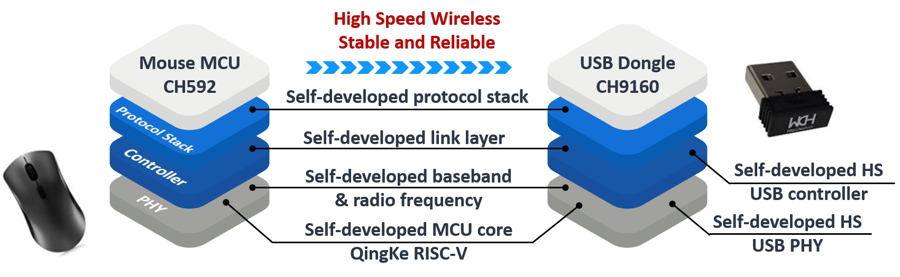
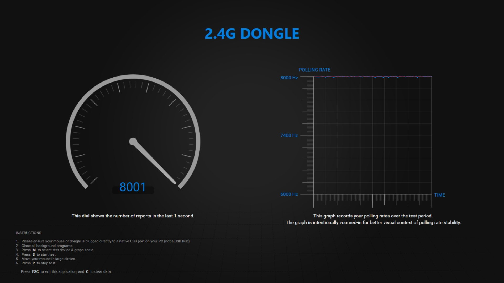

# 8K Polling Rate Wireless Mouse

### 1. Overview

In recent years, the performance of professional mouse has been greatly improved. The bottleneck of the 1KHz polling rate of traditional full-speed USB receivers has become increasingly obvious. High-speed USB receivers that break through the upper limit of the full-speed USB polling rate are becoming the standard for professional wireless devices.

Compared with the common dual-chip solution of high-speed USB MCU+2.4G transceiver chip combined with receiver on the market, the CH9160 single chip integrates WCH's self-developed USB2.0 high-speed transceiver PHY, 2.4G RF transceiver, baseband and protocol stack, with streamlined peripherals and a more compact receiver.

WCH's self-developed connection technology has opened up the vertical layers of the physical layer transceiver, controller, and protocol stack, making the components in the chip closely integrated. It not only improves efficiency but also reduces power consumption. CH9160 has stable communication and fast response. When paired with BLE MCUs such as CH592, it can flexibly build a variety of professional applications such as 8KHz polling rate high-performance wireless mouse.

### 2. Application Block Diagram

### 3. Features

- Single-chip receiver, integrating 2.4G and high-speed USB, with a smaller size;
- Paired with BLE chips such as CH592, it can support a polling rate of up to 8KHz;
- Self-developed 2.4G RF transceiver, baseband algorithm and network protocol stack, with stable communication and fast response;
- Self-developed high-speed USB PHY and other professional interface IP and Qingke RISC-V core, lower cost;
- Plug and play, no driver installation required; supports common devices such as computers, tablets and mobile phones.

### 4. Catalog Introduction

- **datasheet**: This directory contains the datasheet of CH9160

- **hardware**: This directory contains the schematics of the 8K polling rate wireless mouse
    - **CH592F-3MODE-MS-T0-1v2**: Schematic diagram of CH592F tri-mode mouse
    - **WCH-CH9160-R0-1v0**: Schematic diagram of CH9160 2.4G receiver

- **software**: This directory contains software DEMO for 8K polling rate wireless mouse
    - **8k_3mode_592**: Software DEMO of CH592F tri-mode mouse
        - **BLE**: 
            - **3mode_2_4G**: The project of realizing the 2.4G communication function of the tri-mode mouse
            - **3mode_BLE**: The project of realizing the BLE communication function of the tri-mode mouse
            - **3mode_IAP**: The project of realizing the IAP upgrade function of the tri-mode mouse
            - **3mode_JumpIAP**: The project of realizing the function of jumping to IAP code after the tri-mode mouse is started
            - **HAL**: Hardware related files
            - **LIB**: BLE protocol stack related files
            - **MOUSE**: Button scanning and optical sensor related files
            - **RF_LIB**: 2.4G protocol stack related files
        - **SRC**: 
            - **Ld**: link file, different projects use different link files
            - **RVMSIS**: Kernel system header files
            - **Startup**: Startup file, different projects use different startup files
            - **StdPeriphDriver**: Basic peripheral driver source files and header files
    - **8k_dongle_592_9160**: Software DEMO of CH9160 2.4G receiver
        - **dongle**: The project of realizing the 2.4G receiver function
        - **dongle_IAP**: The project of realizing the IAP upgrade function of the 2.4G receiver
        - **dongle_JumpIAP**: The project of realizing the function of jumping to IAP code after the 2.4G receiver is started
        - **SRC**: 
            - **Ld**: link file, different projects use different link files
            - **RVMSIS**: Kernel system header files
            - **Startup**: Startup file, different projects use different startup files
            - **StdPeriphDriver**: Basic peripheral driver source files and header files

- **tool**: [PollingRateTesterApp](https://dl.razerzone.com/drivers/PollingRate/win/PollingRateTesterApp_v1.00.01.exe)

### 5. Instructions

#### 5.1 Software Development

The IDE used to develop this project is [MounRiver Studio](http://www.mounriver.com/). The projects in the directory **software** can be directly opened with **MounRiver**. The compiled hex file is downloaded to the board through [WCHISPTool](https://www.wch-ic.com/downloads/WCHISPTool_Setup_exe.html).

Note: **3mode_IAP** and **3mode_JumpIAP** projects will report errors when they are compiled. Therefore, modification is not supported. Simply select the compiled firmware to download.

#### 5.2 CH592 Programming

1. Connect the CH592 development board to the PC via a USB cable.
2. Press the Download button (①, PB22 pull-down), then turn on the switch to power on the CH592 (②). At this time, CH592 runs the Bootloader program, and the computer will recognize a USB device.
3. WCHISPTool will automatically recognize CH592 (③) and open the download interface.
4. Select the firmware in hex/bin format generated by the IDE (④). The tri-mode mouse consists of multiple projects. You need to select and download the firmware generated by all projects, and WCHISPTool will automatically combine them.
5. Click Download to program CH592 (⑤).

#### 5.3 CH9160 Programming

1. Connect the UART PA1/PB8 or PA14/PA15 (①) of CH9160 to the serial port tool. Note that do not power on CH91E60 at this time.
2. Select CH591 as the chip type in WCHISPTool (③). Select the download interface as the serial port. Select the serial port number to be used (④).
3. Select the firmware in hex/bin format generated by IDE (⑤). The 2.4G receiver consists of multiple projects. You need to select and download the firmware generated by all projects. WCHISPTool will automatically combine them.
4. Click Download (⑥). At this time, WCHISPTool is sending serial port commands at a high frequency to detect whether the serial port of CH9160d is connected.
5. Power on CH9160 (②). CH9160 will run the Bootloader program for 10ms. When WCHISPTool successfully negotiates with the Bootloader of CH9160 through the serial port, WCHISPTool will program CH9160 through the serial port.

#### 5.4 Mode Switch

- **2.4G mode**: PB14 pull-down
- **BLE mode**: PB15 pull-down
- **USB mode**: neither pull-down

#### 5.5 Polling Rate Test

Currently, in the CH592F+CH9160 solution, only the 2.4G mode can achieve an 8K polling rate. Due to the limitation of the BLE protocol, the BLE mode cannot achieve an 8K polling rate. CH592 comes with full-speed USB, so the USB mode cannot achieve an 8K polling rate. Adding an MCU that supports high-speed USB, such as CH32V305, to the tri-mode mouse can achieve an 8K polling rate in USB mode.

In 2.4G mode, the communication distance between the tri-mode mouse and the 2.4G receiver is within 1 meter. The polling rate measured by PollingRateTesterApp is:

