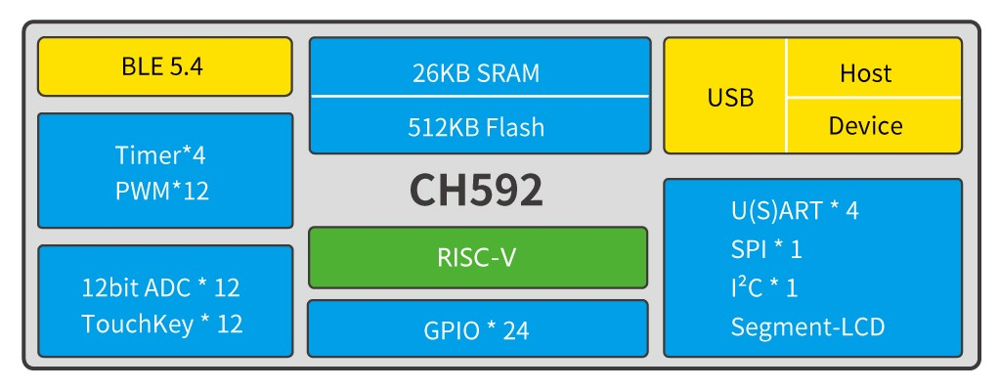
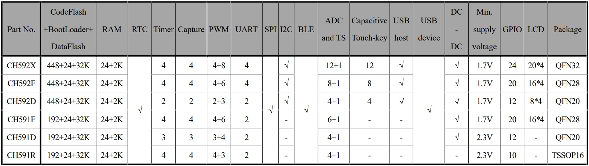

# RISC-V Core BLE5.4 Wireless MCU - CH592

### Overview

CH592 is a RISC-V MCU microcontroller with integrated BLE wireless communication. On-chip integration of 2Mbps BLE communication module, full-speed USB host and device controller and transceiver, segment LCD driver module, SPI, 4 serial ports, 12-channel ADC, TouchKey detection module and other rich peripheral resources.

### System Block Diagram

### Features

 - QingKe 32-bit RISC-V4C core
 
 - Support RV32IMAC instruction set and self-extending instructions
 
 - 26KB SRAM, 512KB Flash, support ICP, ISP and IAP, support OTA wireless upgrade
 
 - Built-in 2.4GHz RF transceiver and baseband and link control, support BLE5.4
 
 - Support 2Mbps, 1Mbps
 
 - -95dBm RX sensitivity, programmable +4.5dBm TX power
 
 - Provide optimized protocol stack and application layer API, and support networking

 - Built-in Temperature Sensor (TS)

 - Built-in RTC, support 2 modes of timing and triggering

 - USB2.0 full-speed Host/Device

 - 12-channel TouchKey

 - 12-channel 12-bit ADC

 - 4 UARTs,1 SPI, 12-channel PWM, 1-channel I2C

 - Segment-LCD driver interface. Support 80-point (20*4) LCD panel

 - 24 GPIO, 4 of them support 5V signal input

 - Minimum support 1.7V power voltage

 - Built-in AES-128 encryption and decryption, unique chip ID

 - Package: QFN32, QFN28, QFN20, TSSOP16

 ### Product Selection Guide

